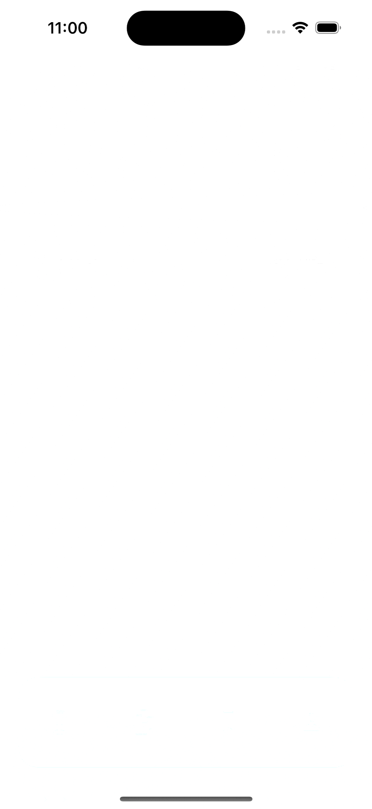

# Cocktails - Clean Architecture / API Rapid / SwiftUI17 👋

App using dribbble design, connect with API Rapid and using [Cocktail App](https://dribbble.com/shots/19486965-Cocktail-Recipe-App)
<p align="center">
<a href="#">
 
</a> 
<br><br>
     Dribbble desing connected with API Rapid
    <br><br>
  <a href="#">
    
  </a>
  <a href="#">
    
  </a>
  <a href="#">
    
  </a>
  <br>
    <br>
    <a href="https://github.com/brsaca/Cocktails/issues/new">Report bug</a>
    ·
    <a href="https://github.com/brsaca/Cocktails/issues/new">Request feature</a>
</p>

## 📝 Steps to run demo
- Create an account on [rapidApi](https://rapidapi.com)
- Use [api cocktails](https://rapidapi.com/rapihub-rapihub-default/api/the-cocktail-db3)
- Create a Config.swift file where you should put your keys
```swift
import Foundation

struct Config {
    static let rapidKey = ""
    static let rapidHost = "the-cocktail-db3.p.rapidapi.com"
    static let rapidUrl = "https://the-cocktail-db3.p.rapidapi.com/"
}
```

## 👤 Author

**Brenda Saavedra**

- WebPage: [brendasaavedra.com](http://brendasaavedra.com)
- Github: [@brsaca](https://github.com/brsaca/)
